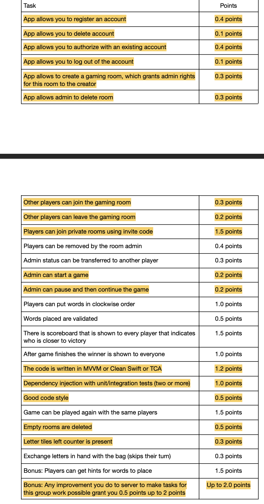

# Мобильное приложение для игры в Scrabble

- Хамид Карим
- Морин Илья

## Что сделано 
- Во-первых, сделано много правок в коде сервера, потому что как минимум, он не запускается... Сделано целых 5 изменений(это фиксы багов + новые ручки, которых нет, а для выполнения домашнего задания они нужны). Я сделал Pull Reqest в репозиторий и описал что добавлено. https://github.com/prettycrewcutyulia/Server_Scrabble/pull/1

- Проект сделан на паттерне MVVM. Все экраны приложения разделены на 3 части: Model, View, ViewModel. Также, использованы менеджеры для работы с хранением информации о пользователе.

Краткое описание файлов:
```
├── Model
│   ├── Room.swift
│   └── User.swift
├── View
│   ├── ContentView.swift  - Входная точка, где происходит выбор авторизации
│   ├── CreateRoomView.swift  - Экран создания комнаты
│   ├── GameRoomSettingsView.swift  - Экран настроек внутри комнаты. Они видны только для администратора комнаты
│   ├── GameRoomView.swift  - Основной экран комнаты, на котором можно разместить игровое поле.
│   ├── LoginView.swift  - Экран авторизации
│   ├── ProfileView.swift  - Экран профиля, в котором можно выйти из аккаунта и удалить аккаунт
│   ├── RegistrationView.swift  - Экран регистрации
│   ├── SplashScreenView.swift  - Экран загрузки приложения
│   └── СhooseRoomView.swift  - Экран выбора, создать комнату или присоединиться к существующей. Присоединение к комнате происходит на этом же экране в виде модального окна
├── ViewModel
    ├── AuthViewModel.swift  - ViewModel для логики запросов авторизации
    ├── ProfileViewModel.swift  - ViewModel для логики запросов к аккаунту
    ├── RegistrationViewModel.swift  - ViewModel для логики запросов регистрации
    ├── RoomViewModel.swift  - ViewModel для логики запросов к комнате
    └── TableViewModel.swift  - ViewModel для логики запросов к списку пользователей внутри комнаты. В данный момент пустой и не используется
├── Manager
│   ├── SessionManager.swift  - Менеджер для работы с хранилищем данных о сессии пользователя
│   └── UserManager.swift  - Менеджер для работы с хранилищем данных о пользователе
```

Решили для простоты просто выделить пункты, которые реализованы и на которые мы претендуем на оценку. 

P.S: Пустые комнаты удаляются при выходе последнего участника комнаты. Стиль кода считаем хорошим, так как методы классов переиспользуются, постарались не размывать бизнес логику на разные экраны. Переменные, например ссылки на сервер, токен и jwt хранятся в одном месте. Насчет бонуса за сервер также рассчитываем на 2 балла, так как изменений внесено много, хотя в строках кода это не так заметно. Большее время ушло на поиск ошибок и их исправление.